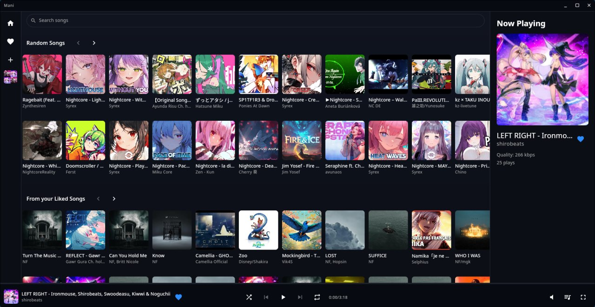
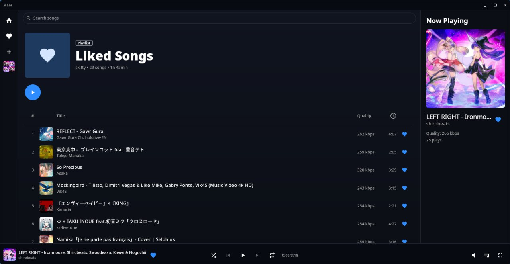
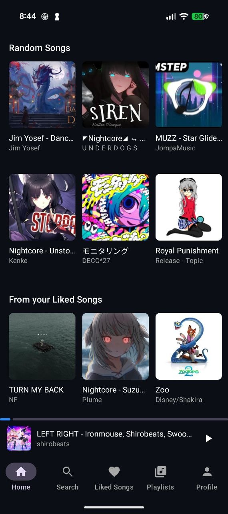
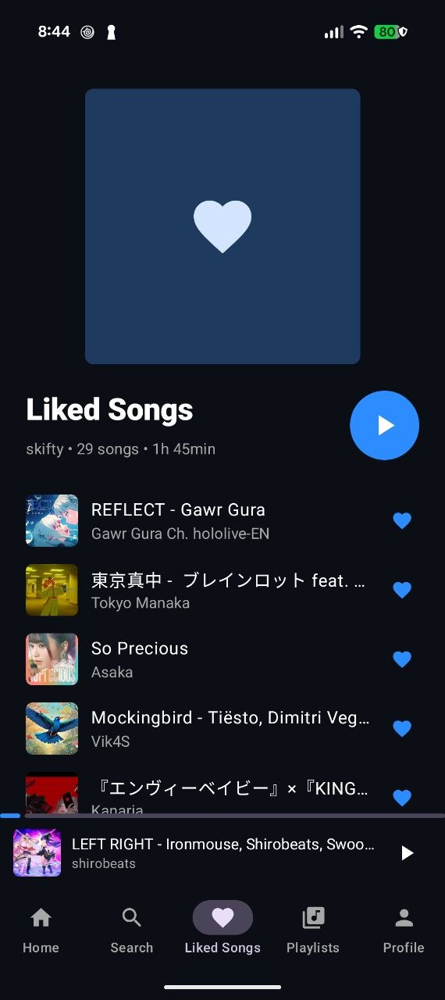
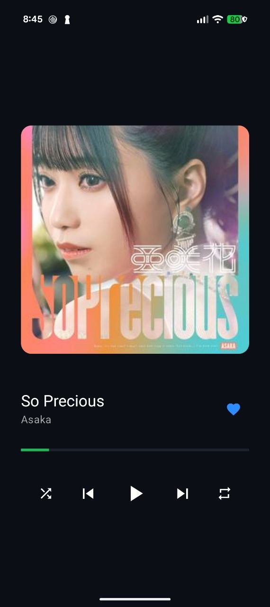

# AI Usage
> [!WARNING]
> This whole app is pretty much written by Claude. I wanted to get it done pretty quickly just as a personal project, so I can finally move away from ytm/spotify. I did read over the code and while it's pretty messy, I chose to leave it as is, since it's not meant to be developed further anyways.

I personally hate fully relying on AI (or relying on it at all if I'm completely honest), but with the feature list I wanted, I didn't want to spend 2 - 3 months to fully grasp everything just for an app that is only made for my own personal use...

Had I more freetime I would've probably coded it myself, but we truly live in a society, eh?

Anyways, the rest of the README is by Claude, so have fun with that.

# Mani

A Subsonic/Navidrome music client for desktop and Android, built with Kotlin
Multiplatform and Compose Multiplatform. Desktop playback is driven by
[mpv](https://mpv.io/) over its JSON IPC socket, with MPRIS integration on
Linux. Android playback runs on Media3/ExoPlayer as a background
service.

## Backend

Mani talks to any standard Subsonic/Navidrome server. It also optionally takes advantage of a
custom Navidrome image - [Skiftstar/navidrome-recap](https://github.com/Skiftstar/navidrome-recap/tree/claude/custom-stats) -
which extends the `scrobble` endpoint with an `msPlayed` param for precise listen-duration
tracking; Mani sends real elapsed listen time (excluding paused time, unaffected by seeking) as
that param on every scrobble. A stock Subsonic/Navidrome server just ignores the extra param, so
this works unmodified against either.

That same fork also adds a `getRecap` endpoint (top songs/artists and a taste profile over a date
range), which powers the Home screen's "Your Favorites" shelf - your top 50 most-played songs
over the last 30 days. This one's a genuine extra feature, not just an ignorable param: on a
stock server the request fails and the shelf simply doesn't appear, with the rest of Home
(Random Songs, Liked Songs) completely unaffected.

It also adds a `getVibeSimilarTracks` endpoint (songs similar to a given VibeNet taste profile -
7 stats: acousticness, danceability, energy, instrumentalness, liveness, speechiness, valence -
each also returned directly on every song, alongside a repeatable `exclude` param), which powers
Autoplay: once the queue runs low, Mani averages those 7 stats across the songs the user has
actually queued (not counting anything Autoplay itself already added), fetches ~20 songs matching
that profile while excluding everything already anywhere in the queue, and seamlessly continues
into them once the queue would otherwise run out - for as long as playback continues, since each
new batch reseeds the next. Manually adding or removing a queued song changes that average, so it
recomputes any still-pending batch. Autoplay can be toggled on Android (Profile screen, on by
default); desktop always has it on, since it has no settings screen yet. Same graceful degradation
as `getRecap`: on a stock server the request fails (or songs simply lack the 7 stats) and Autoplay
simply never triggers, with normal queue playback completely unaffected.

## Screenshots

**Desktop**

<p>
  
  
</p>

**Android**

<p>
  
  
  
</p>

## Building from source

**Prerequisites** (all platforms): JDK 17 or newer. For Android specifically,
an installed Android SDK (the easiest way is via
[Android Studio](https://developer.android.com/studio)) with `platform-tools`
on `PATH` for `adb`.

### Run the development build

- Linux (desktop): `./gradlew :desktopApp:run`
- Windows (desktop): `.\gradlew.bat :desktopApp:run`
- Android: `./gradlew :androidApp:installDebug` (or `.\gradlew.bat` on
  Windows) to install onto a connected device or a running emulator, then
  launch **Mani** from the app drawer - or skip the app drawer and run
  `adb shell am start -n xyz.skifty.mani/.MainActivity` directly.

Desktop's dev build runs directly against your system's installed `mpv` (on
PATH) - no packaging step involved, the quickest way to iterate.

### Package a distributable build

| Target | Command | Extra build-machine prerequisites |
| --- | --- | --- |
| Windows `.msi` | `.\gradlew.bat :desktopApp:packageReleaseMsi` | [7-Zip](https://www.7-zip.org/) (`7z` on PATH) - used to fetch and unpack the bundled `mpv` build |
| Linux `.deb` | `./gradlew :desktopApp:packageReleaseDeb :desktopApp:addMpvDependencyToDeb` | `dpkg-deb`/`fakeroot` (e.g. `sudo apt install dpkg-dev fakeroot`, or `sudo pacman -S dpkg fakeroot` on non-Debian distros) |
| Linux `.AppImage`-style app-image | `./gradlew :desktopApp:packageReleaseAppImage` | - |
| Android (debug) | `./gradlew :androidApp:assembleDebug` | - |

`addMpvDependencyToDeb` must run *after* `packageReleaseDeb` - it patches the
already-built `.deb`'s dependency list, since Compose's Gradle plugin
doesn't expose a way to declare that directly.

### Arch Linux, via the local `PKGBUILD`

[`packaging/arch/PKGBUILD`](packaging/arch/PKGBUILD) builds and installs
Mani the normal Arch way:

```shell
cd packaging/arch
makepkg -si
```

This isn't published to the AUR yet (see the Installation table above) - it
clones from this repo's GitHub remote, so push any local changes you want
reflected before running it.

## Project structure

This is a Kotlin Multiplatform project targeting Android and Desktop (JVM):

* [`/shared`](./shared/src) contains the code shared across the Android and
  desktop apps - UI (Compose Multiplatform) and business logic alike.
  - [`commonMain`](./shared/src/commonMain/kotlin) is for code common to all
    targets - most screens/components, the Subsonic API client, and the
    `AudioPlayer` interface both platforms implement against.
  - Other folders are for Kotlin code compiled only for the platform named
    in the folder - [`jvmMain`](./shared/src/jvmMain/kotlin) for the desktop
    (JVM) target (window chrome, the sidebar, mpv/MPRIS integration,
    Windows/Linux secure storage), [`androidMain`](./shared/src/androidMain/kotlin)
    for Android (the bottom nav shell and Now Playing screen, the
    Media3/ExoPlayer-backed playback service, Android Keystore-backed secure
    storage).
  - Dependency injection is [Koin](https://insert-koin.io/) - a common module
    for what's shared, plus one module per platform for what isn't (see
    `di/` under each source set above).
* [`/androidApp`](./androidApp/src) is the thin entry-point module that
  builds the Android application (`MainActivity`, `ManiApplication`,
  manifest, launcher icons) - depends on `shared`.
* [`/desktopApp`](./desktopApp/src) is the thin entry-point module that
  builds the desktop (JVM) application (`main()`, packaging config) -
  depends on `shared`.
* [`/packaging`](./packaging) holds distro-specific packaging files not
  produced directly by Gradle (currently just the Arch `PKGBUILD`).

## Roadmap

- [ ] Profile settings (both platforms)
- [x] Home screen layout (both platforms - currently an empty stub on each)
- [x] Home screen "Your Favorites" shelf (top 50 most-played songs over the
      last 30 days, via the custom Navidrome fork's `getRecap` endpoint - see
      Backend)
- [x] Playlist creation
- [x] Subsonic/Navidrome login & session persistence
- [x] Playback, with seeking, volume, and a progress bar (mpv-backed on
      desktop; Media3/ExoPlayer-backed on Android, as a foreground service
      with lock-screen/notification controls)
- [x] MPRIS integration (Linux desktop media controls/OSD)
- [x] Playback queue (shuffle, loop, skip)
- [x] Search
- [x] Liked Songs
- [x] Playlist browsing, including each playlist's total song count/runtime
- [x] song context menu play, add to queue,
      like/unlike, add to/remove from playlist
- [x] playlist context menu play, delete
- [x] Scrobbling
- [x] Global Space-to-pause keybind (desktop only)
- [x] Windows/Linux packaging (`.msi`, `.deb`, `.AppImage`, Arch `PKGBUILD`)
- [x] Android navigation shell - bottom nav (Home/Search/Liked Songs/
      Playlists/Profile), a mini-player above it whenever something's
      playing, and a full-screen Now Playing view that expands from it with
      an animated transition (swipe up from there to jump to the playing
      song's playlist, or back-gesture to collapse)
- [x] Android Audio Visualizer (toggleable in profile screen)
